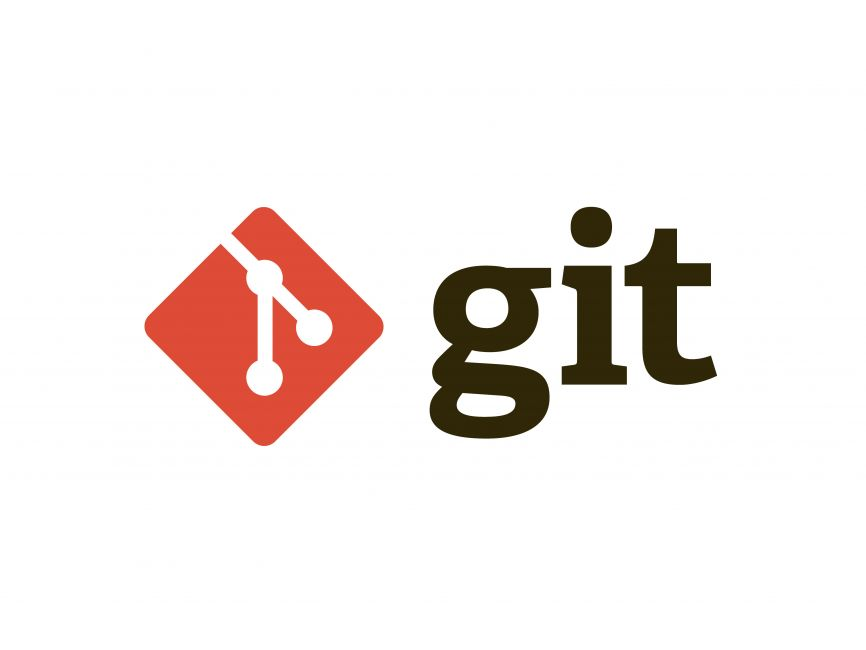

# Git command there we always use to manage the project

Keeping the git command line that we usually use to manage coding

- Reffer Documentation [Click Here](https://www.w3schools.com/git)

## 1. List the git versions

```bash
git --version
```

## 2. Initialize the git

```bash
git config --global --list # list all git caches
git config --global user.name "<git_username>" # login into git by username
git config --global user.email "<git_email>" # login into git by email
```

## 3. Enable git configuration

```bash
git init
```

## 4. See the git status

```bash
git status
```

## 5. Git Add

```bash
git add ex1.ts ex2.ts # Add single file
# or
git add . # Add all files
```

## 6. Hold files, but need to reuse it on the feature (No commit changes)

- Use git stash to hidden files there are not complete yet, But need to switch to another branch

```bash
git add ex1.ts # Add before hidden
git stash
git stash list # List files that were hidden
git stash pop # Reuse the files that were stash or hidden
#
```

## 7. git commit

```bash
git commit -m "<description of comments>"
```

## 8. Add clould git remote URL info locally

```bash
git remote add origin <https://github.com/ower_repository.git>
git branch -M main # set branch as main
git push -uf origin <main> # push to main branch on server side as first commit
```

## 9. Push directory to git repository

```bash
git push origin <branch-name>
git push # Only main branch
# or force
git push origin <branch-name> --force
```

## 10. Pull coding from git repository

```bash
git pull origin <branch-name>
git pull # Only main branch
```

## 11. Clean repository when pulling

```bash
git pull origin <branch_name> --prune
```

## 12. Create a new branch

```bash
git branch <branch-name>
# or
git branch switch -c <branch_name> # Create new branch and switch to
# or
git checkout -b <branch_name>
```

## 13. Rename a branch

```bash
git branch -m <old_branch> <new_branch>
# ex:
git branch -m branch-a branch-b
```

## 14. Switch to a new branch

```bash
git switch <branch_name>
# or
git checkout <branch_name>
```

## 15. Merege branch

```bash
git merge <branch_a>
# ex: Need to merge branch-a into branch-b
git switch branch-a
git merge branch-b
```

## 16. Delete a branch

```bash
git branch -d <branch_name>
# or
git branch -D <branch_name>
```

## 17. Refresh when a branch is updated

```bash
git fetch
```

## 18. Cleanup or Refresh branches when were we delete on git server

```bash
git fetch --all --prune
```

## 19. Tags version

```bash
git tag <version>
# ex:
git tag v1.0.0
```

## 20. Git Rollback and cleanup squashed
1. Undo the Last Commit but Keep Changes (Soft Reset)
```bash
git reset --soft HEAD~1
```
2. Undo the Last Commit and Discard Changes (Hard Reset)
```bash
git reset --hard <squash_code>
# ex:
git reset --hard ce34ds
```
**Note:** This will remove all changes from both your working directory and staging area, so only use it if you’re sure you don’t need the changes from that commit.

## 21. Add Origin URL to repository

```bash
git remote add origin <git-url>
```

## 22. Remove URL from local repository

```bash
git remote remove origin
```

## 23. When .gitignore is not working that way to resolve

```bash
git reflogprune
git prune
```

## 24. Verify remote URL

```bash
git remote -v
```

### 25. Change or Update Remote URL

- Refer [Click Here](https://docs.github.com/en/get-started/getting-started-with-git/managing-remote-repositories)

```bash
git remote set-url origin https://github.com/<OWNER>/<REPOSITORY>.git
# ex:
git remote set-url origin https://github.com/OWNER/REPOSITORY.git
```

## 26. Monitor repository log

```bash
git log # monitoring log only
git log --oneline # monitoring log with one line
git log --oneline --graph # monitoring log with one line and graph
git log --oneline --graph --all # monitoring log with one line and all graph
```

## 27. To generate an SSH key on your MacBook for use with GitLab for remote
- follow these steps
1. Check for Existing SSH Keys
- Before creating a new key, see if you already have one. Open your terminal and run:
```bash
ls -al ~/.ssh
```
If files like id_rsa or id_ed25519 (and their .pub versions) exist, you might already have SSH keys. If you want to use these keys, skip to Step 4.
2. Generate a New SSH Key
```bash
ssh-keygen
# or
ssh-keygen -t ed25519 -C "your-email@example.com"
```
4. Copy the SSH Public Key
Copy the contents of your public key file to the clipboard:
```bash
cat ~/.ssh/id_rsa.pub
```
Then select and copy the key from the terminal to gitlab ssh, after this step you can manage gitLab from local machine

## 28. Git CI/CD
- set name as `.gitlab-ci.yml`. Example as below
```bash
stages:
  - test
  - build
  - deploy

default:
  image: golang:latest

testing:
  stage: test
  script:
    - echo "Starting with golang tests..."

compile:
  stage: build
  script:
    - echo "Starting to building binaries..."

deploy:
  stage: deploy
  script:
    - echo "Starting to deploy"
  only:
    - main
    - tags

```
